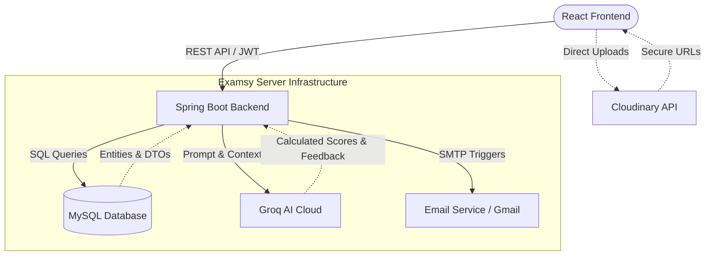

# 🎓 Examsy - Full Stack Examination Platform

Welcome to **Examsy**, a modern, feature-rich online learning and examination platform. Examsy is designed to bridge the gap between traditional testing and modern e-learning by providing a secure, AI-assisted, and highly analytical environment for both students and instructors.

* **Frontend Repository:** [https://github.com/Ruvinda-Shaluka/Examsy-Frontend.git](https://github.com/Ruvinda-Shaluka/Examsy-Frontend.git)
* **Backend Repository:** [https://github.com/Ruvinda-Shaluka/Examsy-Backend.git](https://github.com/Ruvinda-Shaluka/Examsy-Backend.git)

---

## 🌟 Key Features

### 👨‍🏫 For Teachers
* **Smart AI Grading:** Automatically grade short-answer questions using the **Groq API**, providing instant scoring and qualitative feedback based on teacher-provided model answers.
* **Comprehensive Analytics:** Visualize class performance, pass rates, and grade distributions via interactive `Recharts` dashboards.
* **Class Management:** Manage student rosters, approve/reject join requests, post announcements to the class stream, and rotate secure class access codes.
* **Proctoring Dashboard:** Monitor active exams in real-time, view flagged students (tab-switching violations), and broadcast urgent warnings.

### 👨‍🎓 For Students
* **Academic Vault:** A dynamic dashboard separating "Real-Time" scheduled exams from flexible "Deadline-Mode" assignments.
* **Secure Exam Interface:** Built-in tab-security tracking that logs "away time" and issues automated warnings to prevent academic dishonesty.
* **Personal Growth Tracking:** View cumulative GPA, historical score progression, and personalized analytics.
* **Multi-Format Submissions:** Support for Multiple Choice (MCQ), Short Answer, and direct PDF Answer Script uploads.

### ⚙️ System-Wide
* **Role-Based Security:** Strict JWT-based authentication separating Students, Teachers, and Admins.
* **Automated Notifications:** Automated email and push alerts for upcoming 48-hour exam deadlines, graded submissions, and security warnings.
* **Global Search:** Bulletproof autocomplete search to easily navigate between enrolled classes and modules.

---

## 🛠️ Tech Stack

**Frontend (Client-Side)**
* **Framework:** React.js (Vite)
* **Styling:** Tailwind CSS, Lucide React (Icons)
* **Visualizations:** Recharts
* **Document Handling:** React-PDF (`pdfjs-dist`)
* **Routing & HTTP:** React Router DOM, Axios (with JWT Interceptors)

**Backend (Server-Side)**
* **Framework:** Java 21+, Spring Boot 4
* **Security:** Spring Security, JSON Web Tokens (JWT)
* **Database:** MySQL, Spring Data JPA / Hibernate
* **Integrations:** Groq API (LLM for grading), JavaMailSender (SMTP)
* **Storage:** Cloudinary (for direct image and PDF URL mapping)

---

## 🏗️ System Architecture & Data Flow

The following diagram illustrates how the frontend interacts with the backend, database, and external third-party services.



---

## 🚀 Installation & Setup Guide

To run Examsy locally, you must run both the Spring Boot backend and the React frontend simultaneously. Follow these steps in order.

### Prerequisites
* **Java:** JDK 21 or higher
* **Node.js:** v16 or higher (with `npm` or `yarn`)
* **Database:** MySQL Server installed and running locally
* **External Accounts:** A [Groq API Key](https://console.groq.com/), a [Cloudinary](https://cloudinary.com/) account, and a Gmail account with "App Passwords" enabled for SMTP.

### Part 1: Backend Setup
1. **Clone the backend repository:**
   ```bash
   git clone https://github.com/Ruvinda-Shaluka/Examsy-Backend.git
   cd Examsy-Backend
   ```

2. **Create the Database:**
   Open your MySQL client and run:
   ```sql
   CREATE DATABASE examsy_db;
   ```

3. **Configure Environment Variables:**
   Navigate to `src/main/resources/application.properties` and update the following values with your own credentials:
   ```properties
   # Database Configuration
   spring.datasource.url=jdbc:mysql://localhost:3306/examsy_db
   spring.datasource.username=root
   spring.datasource.password=your_mysql_password
   spring.jpa.hibernate.ddl-auto=update

   # Security
   jwt.secret=your_super_secret_256_bit_random_string_here

   # Email Configuration (e.g., Gmail App Passwords)
   spring.mail.host=smtp.gmail.com
   spring.mail.port=587
   spring.mail.username=your_email@gmail.com
   spring.mail.password=your_gmail_app_password

   # AI Grading
   groq.api.key=your_groq_api_key
   ```

4. **Run the Backend:**
   Compile and run the Spring Boot application using Maven:
   ```bash
   mvn spring-boot:run
   ```
   *The backend will start successfully on `http://localhost:8080`.*

### Part 2: Frontend Setup
1. **Clone the frontend repository** (Open a new terminal window):
   ```bash
   git clone https://github.com/Ruvinda-Shaluka/Examsy-Frontend.git
   cd Examsy-Frontend
   ```

2. **Install Dependencies:**
   ```bash
   npm install
   ```

3. **Configure Environment Variables:**
   Create a file named `.env` in the root directory of the frontend project and add the following:
   ```env
   # Points to your local Spring Boot server
   VITE_API_BASE_URL=http://localhost:8080/api/v1

   # Cloudinary Configuration for PDF/Image uploads
   VITE_CLOUDINARY_CLOUD_NAME=your_cloudinary_cloud_name
   VITE_CLOUDINARY_DOCUMENT_PRESET=your_unsigned_upload_preset
   ```

4. **Run the Frontend:**
   ```bash
   npm run dev
   ```
   *The frontend will start, typically on `http://localhost:5173`. Open this URL in your browser to access Examsy.*

---

## 📁 Core Directory Structures

### Frontend Overview
```text
src/
├── components/     # Reusable UI (Alerts, Buttons, Modals, Navbars)
├── context/        # React Context (Theme, Auth)
├── hooks/          # Custom hooks (e.g., useTabSecurity for proctoring)
├── pages/          # Full route views (Student Dashboard, Teacher Grading)
└── services/       # Axios API integration layer (studentService, teacherService)
```

### Backend Overview
```text
src/main/java/lk/ijse/examsybackend/
├── controller/     # REST API Endpoints (separated by Role: Admin, Teacher, Student)
├── dto/            # Data Transfer Objects (Request/Response/Common structures)
├── entity/         # JPA Database Models (Exam, Submission, UserAccount, etc.)
├── repository/     # Spring Data JPA Interfaces
├── service/        # Core Business Logic (SmartGrading, Proctoring, Scheduling)
└── security/       # JWT Filters and Authentication configuration
```

---

*Built with ❤️ for modern education.*
